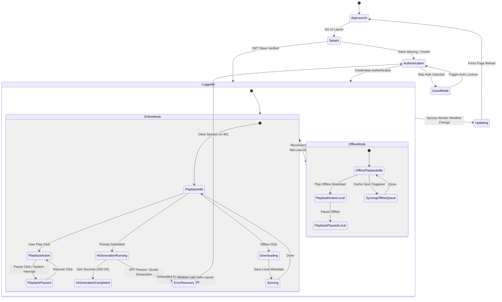

# Chotify Information Architecture
**Version:** 1.0.0  
**Status:** Production-Ready Blueprint  
**Target Platform:** Web (Desktop, Mobile, Tablet)  

---

## 1. Information Architecture Philosophy

Chotify’s layout and structured hierarchies are designed to keep the user focused and relaxed. The information architecture is organized around six foundational principles:

### Progressive Disclosure
We never present complex options all at once. When a user enters the AI Studio, they see only a single prompt input field and a prominent generation button. Granular controls—such as BPM selectors, key signatures, and model seeds—remain tucked away in a collapsible "Parameters" tray. By hiding details until they are intentionally requested, we prevent interface paralysis.

### Reduction of Cognitive Load
No dashboard view should display more than seven high-level menu categories or three active columns. Visual dividers (1px borders) are strictly aligned to the 8pt spacing system, creating predictable geometric regions. Monospaced data blocks are reserved for numbers and prompts, making them instantly distinguishable from standard layout labels.

### Thumb-Friendly Mobile Navigation
On mobile screens, 75% of interactive gestures occur within the bottom 40% of the screen. Accordingly, all critical triggers (the Play/Pause button, search bar entry point, primary navigation tabs, and prompt submit button) are positioned at the bottom of the screen to allow easy one-handed navigation.

### Natural AI Integration
Instead of treating AI as an external "plugin" or an isolated "magic wand" feature, AI is treated as a core part of the system. Generative tools sit in the primary sidebar navigation right next to the user's Library. Generated tracks reside inside standard playlists, marked only by a subtle `[ SYNTH ]` metadata badge, showing that AI-generated audio is a first-class citizen of the ecosystem.

### Music First (Uninterrupted Playback)
The persistent music player is the anchor of the visual experience. Navigating pages, modifying settings, or generating new track prompts must never pause, stutter, or reset the active audio stream. Transitions between layouts occur in the background, keeping the audio playback thread fully isolated.

### One Primary Action per Screen
Every viewport defines a singular priority action. On the home page, it is "Play Recommendations"; in the AI Studio, it is "Generate Track"; and in the Settings panel, it is "Validate API Keys". Secondary workflows are styled with lower visual weight (outline or tertiary buttons) to guide the user's attention.

---

## 2. Sitemap

The sitemap defines every screen inside Chotify, separated by access level (Guest vs. Authenticated vs. Admin) and layout parent.

### Visual Sitemap Diagram

```
[Internet Gateway]
       │
       ├── Guest Route (Unauthenticated)
       │    ├── /landing (Brand Vision & Features)
       │    ├── /login (Email & Password entry)
       │    ├── /register (Account registration & API key prompt)
       │    └── /forgot-password (Reset validation)
       │
       └── Authenticated Route (User Dashboard)
            ├── /home (Personalized feeds, recents, queue)
            ├── /explore (New releases, genres, trending, collections)
            ├── /search (Instant filters, recent queries, semantic input)
            │
            ├── /library (Root container)
            │    ├── /library/liked (Songs bookmarked by user)
            │    ├── /library/playlists (User-curated playlists)
            │    ├── /library/generations (History of generated tracks)
            │    └── /library/downloads (Cached offline tracks)
            │
            ├── /studio (AI Workspace console)
            │    ├── /studio/composer (Song generation console)
            │    ├── /studio/remix (Stem uploader & style models)
            │    ├── /studio/lyrics (Generative text writer)
            │    ├── /studio/cover-art (Algorithmic cover generator)
            │    └── /studio/history (Log of prompt seeds & weights)
            │
            ├── /settings (Configuration hub)
            │    ├── /settings/account (Profile details)
            │    ├── /settings/playback (Equalizer, crossfade, normalization)
            │    ├── /settings/providers (API key management for Udio/Suno/OpenAI)
            │    └── /settings/developer (Telemetry, debug console, raw JSON export)
            │
            └── /admin (System Operations - Staff only)
                 ├── /admin/upload (Acoustic audio manager)
                 ├── /admin/moderation (Flagged generative outputs)
                 └── /admin/analytics (Active generation loads & playback counts)
```

---

## 3. Navigation System

Chotify uses a multi-layered navigation system that adapts to screen sizes while keeping core actions consistent.

### Mobile Navigation Layout
*   **Bottom Navigation Bar (Height: 56px):** The default mobile navigation hub. Contains four touch targets with text labels in monospace typography:
    1.  `[ HOME ]`
    2.  `[ EXPLORE ]`
    3.  `[ STUDIO ]`
    4.  `[ LIBRARY ]`
*   **Mini Player Interface:** A floating card (Height: 48px, Radius: 8px) positioned exactly 8px above the bottom navigation bar. A tap expands it into the full-screen player modal.
*   **Gesture System:** Swiping right-to-left on any track in a list adds it to the queue; swiping left-to-right bookmark-saves it. Swiping down on the expanded player slides it back to the mini-player dock.

### Desktop Navigation Layout
*   **Collapsible Sidebar (Width: 240px):** Divided by 1px borders. Categories include:
    *   **Discover:** Home, Explore, Search.
    *   **Library:** Liked, Playlists, Generated, Downloads.
    *   **Studio:** Composer, Remix Deck, Prompt Library.
*   **Top Header Bar (Height: 64px):** Fixed boundary. Displays back/forward breadcrumb navigation, global search, notifications toggle, and the profile avatar menu.
*   **Keyboard Shortcuts:**
    *   `Space`: Toggle Play/Pause.
    *   `Cmd/Ctrl + K`: Open Command Palette / Global Search.
    *   `Cmd/Ctrl + G`: Go to AI Composer.
    *   `L`: Like/Bookmark active track.
    *   `Right Arrow` / `Left Arrow`: Forward/Rewind 5 seconds.

### Tablet Navigation Layout
*   The sidebar collapses into a narrow 64px vertical icon-bar, maximizing the central grid layout workspace.
*   The music player displays as a persistent panel on the right sidebar, creating a split-screen listening and browsing layout.

---

## 4. User Personas

We design Chotify to support three distinct user personas, tailoring layouts to their workflow priorities.

### Persona 1: Leo — The Casual Listener (Student, Age 21)
*   **Goals:** Wants an elegant, distraction-free environment to listen to instrumental music while studying. Hates social feeds and notifications.
*   **Pain Points:** Traditional apps recommend commercial pop music, have loud visual ads, and require constant clicking to find focus playlists.
*   **Primary Journey:** Launches app, clicks "Listen Now" on the Home page recommendation, collapses the UI into full-screen album art focus mode.

### Persona 2: Kora — The AI Music Creator (Sound Hobbyist, Age 29)
*   **Goals:** Wants to synthesize, remix, and catalog custom audio tracks. Uses personal API keys (Suno/Udio) to generate loops, stems, and full compositions.
*   **Pain Points:** Generative platforms lack basic music library management (sorting, queuing, metadata editing) and don't allow connecting personal keys.
*   **Primary Journey:** Enters AI Studio, configures BPM/key values, inputs prompts, downloads generated stems, and adds the final mix to a personal playlist.

### Persona 3: Jax — The Content Creator (Streamer, Age 26)
*   **Goals:** Needs a constant stream of royalty-free, high-quality lo-fi background music for video streams.
*   **Pain Points:** Getting copyright strikes on YouTube/Twitch for background music; slow workflow to generate background tracks.
*   **Primary Journey:** Navigates to AI Studio, launches AI Radio with custom seed settings, and streams synthesized background music continuously with live license metadata displayed.

---

## 5. User Journeys

Every path in Chotify is designed to be frictionless, with clear recovery routes for errors.

### Journey A: Connecting a Custom AI Provider API Key
```
[User Profile / Header] ──> [Settings] ──> [AI Providers Panel] ──> [Input API Key] ──> [Test Connection] ──> [Save & Activate]
```
1.  **Goal:** Enter and validate personal API keys to unlock AI generation.
2.  **Entry Point:** Settings icon in the top header.
3.  **Steps:**
    *   Navigate to the `AI Providers` tab.
    *   Select provider (e.g., `Suno v3.5`).
    *   Paste the API key into the text field.
    *   Click `Test Connection` (triggers a lightweight metadata request).
4.  **Decision Point:** If the connection test returns a green checkmark, click `Save Key`.
5.  **Exit Point:** Toast notification: "Provider Connected Successfully. Composer Unlocked." Redirects to AI Studio.
6.  **Possible Errors & Recovery:**
    *   *Error: Key validation failed (Invalid Key).*
    *   *Recovery Path:* The input border turns red, showing a message with the API provider's error code (e.g., `401 Unauthorized`). A secondary button links directly to the provider's API key dashboard to retrieve the correct key.

### Journey B: Generating a Custom Track in the AI Studio
```
[Sidebar] ──> [AI Studio / Composer] ──> [Input Prompt] ──> [Configure Stems] ──> [Synthesize] ──> [Save to Library]
```
1.  **Goal:** Write a prompt and synthesize a custom track.
2.  **Entry Point:** `Studio` link in sidebar.
3.  **Steps:**
    *   Click in the prompt text area (defaults placeholder text: "Enter description...").
    *   Type: "Lofi beat, sand texture, warm acoustic guitar chords".
    *   Expand `Parameters` and select: BPM: `78`, Key: `G Minor`.
    *   Click `Synthesize` (Aura Gold CTA).
4.  **Decision Point:** Listen to the generated preview. Choose to either `Refine Prompt` or `Save Track to Library`.
5.  **Exit Point:** Clicks `Save to Library`. Track is added to `/library/generations`.
6.  **Possible Errors & Recovery:**
    *   *Error: AI Provider rate limit reached (Insufficient Balance).*
    *   *Recovery Path:* The console shows a warning toast: "Quota Exceeded on Suno API". The app displays a diagnostic modal showing current usage, offering to switch to a fallback provider (e.g., Gemini) or open Settings to update API keys.

---

## 6. Screen Inventory

This catalog lists every viewport in the application, ensuring every layout state is accounted for.

| Screen Name | Path | Purpose | Primary Action | Navigation Source | Exit Paths | Dependencies | Future Expansion |
| :--- | :--- | :--- | :--- | :--- | :--- | :--- | :--- |
| **Landing** | `/landing` | Showcase brand values and features. | Click `Get Started` | Root URL | `/login`, `/register` | None | Interactive audio visualizer widget. |
| **Auth Gateway**| `/login` | Secure user access. | Submit credentials. | Landing page | `/home`, `/register` | JWT Auth API | Passkey support. |
| **Home** | `/home` | Personal dashboard. | Play recommendations. | Auth login redirect. | `/explore`, Player modal | Recents API | Dynamic real-time listening rooms. |
| **Explore** | `/explore` | Music catalog. | Browse curated mix. | Sidebar link | Artist profiles, Albums | Catalog API | Algorithmic mood charts. |
| **AI Studio** | `/studio` | Core synthesis workspace. | Enter generation prompt. | Sidebar link | Composer, Remix, Lyrics | AI Gateway | Collaborative prompts. |
| **Composer** | `/studio/composer`| Track creator. | Click `Synthesize`. | AI Studio dashboard | `/library/generations` | Suno/Udio APIs | Real-time audio editing. |
| **Remix Deck** | `/studio/remix` | Song style modifier. | Upload audio file. | AI Studio dashboard | `/library/generations` | Storage API | Multitrack stems. |
| **Search Console**| `/search` | Global search engine. | Enter search queries. | Top header search bar | Active playing track | Elastic Search | Semantic search. |
| **Playlist Detail**| `/playlist/:id` | View playlist items. | Play tracks in sequence. | Library page | Track detail, Album | Playlists DB | Dynamic cover-art generator. |
| **Settings Hub** | `/settings` | Global settings. | Save preferences. | Sidebar, Header avatar | Back to previous view | User profile DB | Developer export tools. |
| **Admin Panel** | `/admin` | Content management. | Moderate user tracks. | Direct URL (Staff only) | `/home` | Admin auth role | System alerts dashboard. |

---

## 7. Navigation Hierarchy

Parent-child relationships define how views stack. The maximum layout depth is restricted to three levels.

```
[Level 1: Home Dashboard]
   │
   ├── [Level 2: Playlist View] ──(Click Album)──> [Level 3: Album Detail View]
   │                                                    │
   │                                                    └── [Exit: Active Track in Player]
   │
   ├── [Level 2: Artist Page] ──(Click Discography)──> [Level 3: Album Detail View]
   │
   └── [Level 2: Active Player Modal]
            │
            ├── [Level 3: Lyrics View] (Overlay)
            └── [Level 3: Queue List] (Drawer)
```

---

## 8. Feature Map

Features are categorized by priority and release phase to organize frontend development.

```
┌────────────────────────────────────────────────────────┐
│ CORE SYSTEM (Phase 1)                                   │
│ - Cloud Streaming      - Playlist Manager              │
│ - Email/JWT login     - Custom AI Key Config           │
└────────────────────────────────────────────────────────┘
┌────────────────────────────────────────────────────────┐
│ AI GENERATION (Phase 2)                                 │
│ - AI Composer          - AI Playlist Synthesis         │
│ - Prompt History Log   - Cover Art Fractal Engine      │
└────────────────────────────────────────────────────────┘
┌────────────────────────────────────────────────────────┐
│ EXPERIMENTAL (Phase 3)                                  │
│ - AI Remix Engine      - Real-time Visualizers         │
│ - Semantic Prompt Search                               │
└────────────────────────────────────────────────────────┘
┌────────────────────────────────────────────────────────┐
│ ADMINISTRATIVE & TOOLS (All Phases)                    │
│ - Staff Content Panel  - User Analytics Dashboard      │
│ - Provider Quota Metrics                               │
└────────────────────────────────────────────────────────┘
```

---

## 9. User Permissions

User access is controlled by clear role permissions:

*   **Guest (Unauthenticated):**
    *   *Permitted:* View landing page, listen to 30-second track previews, read the Design System documentation.
    *   *Blocked:* AI Studio generation, creating playlists, accessing settings, or offline caching.
*   **Registered User (Standard):**
    *   *Permitted:* Full audio streaming, custom playlist creation, AI Studio generation (requires personal API key), personal library management.
    *   *Blocked:* Accessing the admin dashboard, editing global catalog metadata.
*   **Premium Tier (Future):**
    *   *Permitted:* Ad-free streaming, cloud backup of AI generated stems, platform-hosted generation pools (without personal keys).
*   **Staff Admin:**
    *   *Permitted:* Global catalog edits, user account moderation, analytics viewing, uploading official label audio.

---

## 10. Content Hierarchy

Information in Chotify is organized to emphasize music and generation history.

```
[Artist Portfolio]
   │
   └── [Album Container]
            │
            └── [Song / Track Entity]
                     ├── Title (Primary)
                     ├── Artist Metadata (Secondary)
                     ├── Audio Waveform Stream
                     └── Source Indicator (Standard vs. [SYNTH])
```

*   **Standard Track:** Displayed with title, artist name, and duration.
*   **AI Synthesized Track:** Emphasizes prompt history. Displays the parent prompt (e.g., `"Muted horn, sand background"`) directly beneath the track name, allowing the user to click the prompt to copy the configuration.

---

## 11. Search Architecture

Search is designed to help users quickly find tracks, prompts, and templates.

*   **Global Search Entry:** The search bar is sticky at the top of the interface. Results group dynamically as the user types, sorted into: `Tracks`, `Artists`, `Playlists`, and `Prompt Seeds`.
*   **Trending Searches:** Displays the most active music genres and popular prompt keywords (e.g., `synthwave`, `70bpm`, `warm ambient`).
*   **Recent Searches:** Lists the user's last 5 queries, stored in local storage for fast access.
*   **Search Filters:** Simple tab filters toggle focus between `Tracks`, `Artists`, `Key Signature`, `BPM Range`, and `Source (Standard vs. AI Generated)`.
*   **AI Semantic Search (Future):** Allows users to search by mood or description rather than exact text (e.g., searching for "music that feels like rain on window panes" queries vector embeddings of song logs).

---

## 12. AI Studio Architecture

The AI Studio is organized into modular workspaces, sharing configurations via Zustand state management.

```
                  ┌───────────────┐
                  │   AI Studio   │
                  │  (Root State) │
                  └───────┬───────┘
                          │
      ┌───────────┬───────┴───────────┬───────────┐
      │           │                   │           │
┌─────▼─────┐┌────▼─────┐       ┌─────▼─────┐┌────▼─────┐
│ Composer  ││  Remix   │       │  Lyrics   ││Cover Art │
│  Console  ││   Deck   │       │ Generator ││  Engine  │
└─────┬─────┘└────┬─────┘       └─────┬─────┘└────┬─────┘
      │           │                   │           │
      └───────────┼───────────────────┴───────────┘
                  │
        ┌─────────▼─────────┐
        │  AI Gateway Node  │
        │(Provider Configs) │
        └───────────────────┘
```

*   **Composer Console:** The core generator. Includes the prompt editor, parameter presets (BPM, scale, key), and the output generation manager.
*   **Remix Deck:** A file upload zone. Allows users to drop a standard MP3 file, select a style profile (e.g., `Lofi`, `Acoustic`), and generate a modified version.
*   **Lyrics Generator:** Generates rhyme structures and vocal guides based on prompt styles.
*   **Cover Art Engine:** Generates abstract, generative designs (Mandelbrot fractals, sound wave wireframes) to use as cover art.
*   **Prompt Library:** A repository containing the user's saved prompt templates.

---

## 13. Settings Architecture

The settings panel is structured into a clean list layout, avoiding nested menu screens.

*   **Account:** Manage username, password resets, and subscription data.
*   **Playback:**
    *   *Crossfade:* Slider (0 to 12 seconds).
    *   *Audio Normalization:* Toggle switch (On/Off).
    *   *Equalizer:* 5-band digital slider widget.
*   **Appearance:** Toggle between `Sand (Light Mode)` and `Carbon (Dark Mode)`.
*   **AI Providers:**
    *   API keys for Suno, Udio, OpenAI, Gemini.
    *   Endpoint host settings.
    *   Validation test buttons.
*   **Downloads:** Storage quota monitor, download quality selectors (128kbps, 256kbps, 320kbps), and a `Clear Offline Cache` button.
*   **Developer Options:** Live console logs, frame rate counter toggle, and a raw user profile JSON export tool.

---

## 14. Error Flow Architecture

When errors occur, Chotify displays clear instructions and technical error logs to make recovery straightforward.

```
┌────────────────────────────────────────────────────────┐
│  ⚠️ System Connection Failure                           │
├────────────────────────────────────────────────────────┤
│  Diagnostic Code: suno_api_timeout_504                 │
│  Error Log: Gateway Timeout during audio synthesis.    │
│                                                        │
│  [ Retry Synthesis ]       [ Check Provider Status ]   │
└────────────────────────────────────────────────────────┘
```

*   **Authentication Errors:** Shows validation warnings under input fields. If the token expires during a session, the user is redirected to the login screen with a toast: "Session Expired. Please sign in again."
*   **Streaming Interruption:** If network connection is lost during playback, the progress bar pauses and a small icon (`[ OFFLINE ]`) appears in the player. The app attempts to reconnect in the background, resuming playback once the connection returns.
*   **AI Provider Timeout:** If an external API fails, the synthesis console switches from a loading state to a warning layout. It outputs the exact raw JSON error from the provider and provides a `Retry` action.

---

## 15. Empty State Map

Empty states are designed to encourage action, providing clear primary buttons to start workflows.

*   **No Playlists:**
    *   *Copy:* "Your library is empty. Let's create your first folder."
    *   *CTA:* `[ Create Playlist ]` (Primary).
*   **No Downloads:**
    *   *Copy:* "Offline mode is empty. Save music to listen without internet."
    *   *CTA:* `[ Browse Tracks ]` (Primary).
*   **No Search Results:**
    *   *Copy:* "No matches found for your query. Try adjusting your filters."
    *   *CTA:* `[ Reset Filters ]` (Primary).
*   **No AI Generations:**
    *   *Copy:* "Your synthesizer log is clear. Write a prompt to begin."
    *   *CTA:* `[ Open Composer ]` (Primary).
*   **Offline Canvas:**
    *   *Copy:* "Internet connection lost. Local downloads are ready."
    *   *CTA:* `[ Play Offline Downloads ]` (Primary), `[ Reconnect ]` (Secondary).

---

## 16. Notification Architecture

Notifications are non-intrusive alerts that appear at the top-right of the viewport and slide off-screen automatically after 4 seconds.

*   **Success Alert:** Clean layout, green indicator border.
    *   *Trigger:* Playlist saved, API key validated.
*   **Warning Alert:** Yellow indicator border.
    *   *Trigger:* API balance running low (quota warning).
*   **Error Alert:** Red indicator border.
    *   *Trigger:* File upload failed, API key validation failure.
*   **AI Completed Alert:** Aura Gold indicator border, features a mini play action.
    *   *Trigger:* AI track synthesis finishes in the background. Clicks play the track instantly.

---

## 20. Experience Principles

Every new feature and system addition in Chotify must satisfy these core principles:

1.  **Never Interrupt the Music:** Audio playback is the priority of the application. No page navigation, background generation, or modal popup may interrupt the active audio stream.
2.  **AI Serves the User:** AI tools must simplify workflows, not add complexity. Generative interfaces should default to simple prompt inputs, keeping technical parameters tucked away.
3.  **Flat, Crisp Hierarchy:** Layout depth must never exceed three levels. If a user needs more than three clicks to reach a track, page, or setting, the flow must be redesigned.
4.  **No Hidden States:** The user must always know where they are. Active page headers, clear breadcrumbs, and selected sidebar states must remain visible at all times.
5.  **Clean Onboarding:** We avoid throwing onboarding screens at new users. Instead, they are introduced to the app via simple placeholder suggestions and intuitive empty states.
6.  **Consistent Grid Layout:** Every new feature must align to the strict 1px grid structure. If a feature requires introducing gradients or circular elements that break grid rules, it is rejected.

---

## 21. Application State Architecture

Chotify's runtime is governed by an explicit state machine. By mapping all client states, we prevent layout flickering, race conditions between audio downloads and playback buffers, and client-server desynchronization during generative processes.

### State Transition Diagram



### State Specifications

#### App Launch (Temporary State)
*   **Entry Condition:** User accesses the domain or launches the container.
*   **Exit Condition:** Checking presence of a valid HTTP-Only auth token. Transitions to Splash.
*   **Interruptions:** Network failure (redirects straight to Offline Mode utilizing last local token cache).
*   **Recovery Path:** Fallback to guest mode validation if token check times out.

#### Splash (Temporary State)
*   **Entry Condition:** Launch check initialized.
*   **Exit Condition:** Checks local metadata configuration. Routes to LoggedIn if active token is verified; routes to Authentication if verification fails.
*   **Persistent Data:** Pre-loads current client settings (Sand/Carbon theme choices).

#### Authentication (Temporary State)
*   **Entry Condition:** Verification fail on app launch or explicit user sign-out command.
*   **Exit Condition:** Clicks `Sign In` (routes to Logged In) or `Continue as Guest` (routes to Guest Mode).
*   **Interruptions:** Invalid input verification, server timeout.
*   **Recovery Path:** Shows inline red validation errors under input fields. Re-enables form input fields immediately.

#### Guest Mode (Persistent State)
*   **Entry Condition:** Selects guest path on login gate.
*   **Exit Condition:** User clicks signup tab or triggers an active core permission wall (e.g., clicking `Synthesize`).
*   **State Constraints:** All AI generation and custom playlists are disabled. Streaming is limited to 30-second previews.

#### Logged In (Root Container State)
*   **Entry Condition:** Token verified or auth completed.
*   **Exit Condition:** Sign out, token invalidation, or app reload.
*   **Sub-states:** Orchestrates synchronization between Online, Offline, Playback, and Generative states.

#### Offline Mode (Active State)
*   **Entry Condition:** Browser `navigator.onLine` returns `false` or ping requests fail.
*   **Exit Condition:** Browser connection event returns `true` and API gateways are pingable.
*   **Restrictions:** AI generation features and catalog searches are disabled. The UI hides locked online features and opens the local cache folder.

#### Online Mode (Active State)
*   **Entry Condition:** Network validation confirms connection.
*   **Exit Condition:** Network loss event triggers.
*   **Data Strategy:** Begins caching metadata syncs and clears temporary queue logs.

#### Playback Active (Persistent Audio Thread)
*   **Entry Condition:** Player triggers play on track, queue item, or playlist.
*   **Exit Condition:** Song finishes, pause event occurs, or buffering error triggers.
*   **Interruptions:** Network loss (pauses and shifts to reconnect attempts), system audio interruption (incoming call).
*   **Recovery Path:** Auto-reduces streaming bitrate if buffer warnings exceed 1500ms before pausing.

#### Playback Paused (Persistent Audio Thread)
*   **Entry Condition:** Pause click, device disconnect, or system override.
*   **Exit Condition:** User clicks resume, skips forward/back, or resets session.
*   **Persistent Data:** Retains current timeline location (in seconds) and audio track index coordinates.

#### AI Generation Running (Temporary Processing State)
*   **Entry Condition:** Click `Synthesize` with a validated prompt, parameters, and active API key.
*   **Exit Condition:** HTTP Status `200` with track preview data returned (routes to AI Generation Completed) or status failure (routes to Error Recovery).
*   **Interruptions:** Network disconnect (cancels request on server, returns error message), token invalidation.

#### AI Generation Completed (Temporary Preview State)
*   **Entry Condition:** Track generation success.
*   **Exit Condition:** User clicks `Save to Library`, `Refine Prompt`, or cancels generation review sheet.
*   **Temporary Data:** Stores the generated preview audio buffer in memory.

#### Downloading (Temporary Cache State)
*   **Entry Condition:** User clicks download icon on track, album, or playlist.
*   **Exit Condition:** Writing binary buffer files to browser IndexedDB completes.
*   **Recovery Path:** If browser space is insufficient, aborts write operation and launches notification: "Storage limit reached. Download failed."

#### Syncing (Temporary State)
*   **Entry Condition:** LoggedIn online initialization or network reconnection event.
*   **Exit Condition:** Sync verification exchange between client Zustand store and remote database completes.
*   **State Constraints:** Keeps local edits locked until synchronization finishes.

#### Updating (Temporary State)
*   **Entry Condition:** PWA Service Worker detects a new version manifest file.
*   **Exit Condition:** Cache replacement finishes. Forces a hot reload of the client browser.

#### Error Recovery (Temporary State)
*   **Entry Condition:** API failure, playback buffer crash, 401 token invalidation.
*   **Exit Condition:** Resolves context, routes to previous safe state or login screen.
*   **State Clean Up:** Clears active timers and resets loading animations.

### Why this State Model Exists
Audio streaming platforms are highly sensitive to network changes. If audio buffers, API generations, and interface states are not managed by a strict state machine, users can experience layout lockups, truncated generation requests, or silent audio player crashes. By isolating playback and synthesis queues into distinct state machines, we ensure that an API connection timeout on the generative AI gateway will never cause a stutter in the active music playback stream.

---

## 22. Feature Dependency Graph

To coordinate backend database deployment, API development, and frontend interface implementation, we map all features to a strict dependency tree.

### Visual Dependency Graph

```
[Authentication / JWT Gateway] (Core)
       │
       └───> [User Profiles] (Core)
                │
                ├───> [API Provider Keys Config] (Core)
                │        │
                │        └───> [AI Studio Console] (AI Studio Core)
                │                 │
                │                 ├───> [AI Composer Node] (AI Phase 2)
                │                 │        │
                │                 │        └───> [Generation History Log] (AI Phase 2)
                │                 │                 │
                │                 │                 └───> [SYNTH Track Index] (AI Phase 2)
                │                 │                          │
                │                 │                          └───> [Player Engine] ──┐
                │                 │                                                  │
                │                 ├───> [AI Remix Deck] (Experimental Phase 3)       │
                │                 │                                                  │
                │                 └───> [AI Lyrics Writer] (Experimental Phase 3)    │
                │                                                                    │
                ├───> [Personal Library] (Core) <────────────────────────────────────┘
                │        │
                │        ├───> [Playlists Manager] (Core)
                │        │        │
                │        │        └───> [Collaborative Portals] (Future Phase 3)
                │        │
                │        └───> [Offline Download Cache] (Future Phase 3)
                │
                └───> [Acoustic Music Catalog] (Core)
                         │
                         ├───> [Global Search Console] (Core)
                         │        │
                         │        └───> [Semantic Search Engine] (Experimental Phase 3)
                         │
                         └───> [Curated Playlists] (Core)
                                  │
                                  └───> [Recommendation Engine] (Phase 2)
```

### Dependency Classifications

*   **Core Dependencies:** Elements required for any basic application function. The app cannot launch without the `Authentication Gateway`, which loads the `User Profile`, which in turn authorizes the `Personal Library` and `Catalog` access.
*   **Optional/Secondary Dependencies:** Enhancements that sit on top of core features. `Curated Playlists` function without the `Recommendation Engine` active (defaulting to standard alphabetical listing).
*   **AI Dependencies:** Features requiring valid keys. `AI Composer` requires `API Provider Keys Config`. `Generation History Log` requires `AI Composer` outputs.
*   **Future/Phase 3 Dependencies:** Advanced additions. `Collaborative Portals` require `Playlists Manager` and WebSocket coordination. `Offline Download Cache` requires service workers and index storage nodes.

### Shared System Services
1.  **Audio Engine (Howler.js wrapper):** Shared service that routes audio streams, controls volume, and manages timelines. Used by standard playback, prompt previews, and remix previews.
2.  **API Gateway Controller:** Directs REST/WebSocket traffic to either the Chotify backend or external AI synthesizers.
3.  **Local Storage Sync Node:** Background worker coordinating browser cache with MongoDB.

### Critical Implementation Path
The minimum viable pipeline to achieve a functioning product is:
```
Auth Gateway ──> Database User Profiles ──> Catalog Index ──> Audio Engine ──> Personal Library ──> API Key Validation ──> AI Composer Node
```

### Features Suitable for Independent Parallel Development
To allow frontend and backend teams to work concurrently, these modules can be developed using mocked interfaces:
*   *AI Cover Art Generator:* Independent canvas module that uses seed values to output graphics.
*   *AI Lyrics Writer:* Text engine that requires no connection to the audio streaming systems.
*   *Settings Interface:* Standard form component mapping inputs to local storage configs.
*   *Global Search UI:* Independent input form that can be built and styled before connecting to search databases.

---

## 23. Data Ownership & State Management Map

To organize client stores, server databases, and browser caching structures, we map every data element to a specific storage location and data owner.

### Data Storage Allocation Map

| Data Type | Storage Layer | Data Owner | Allowed Writers | Persistence | Sync Strategy | Caching Strategy |
| :--- | :--- | :--- | :--- | :--- | :--- | :--- |
| **Authentication (JWT)** | Cookies (HTTP-Only) | Auth Gateway Service | Auth Gateway Service | Session/Refresh Limit | Silent token refresh loop. | None (Session security). |
| **Current User Metadata** | Server Database / Zustand | User Account Service | User Account Service | Permanent | REST validation on profile updates. | Zustand Memory Cache. |
| **Active Theme Skin** | Browser Storage (Local) | Layout Controller | Client Configuration | Permanent | Local storage read on mount. | Local Storage. |
| **Playback Queue** | Zustand Global Store | Audio Engine Service | Player Controller | Active Session | Saved locally to prevent loss on reload. | Zustand Memory Cache. |
| **Current Active Track** | Zustand Global Store | Audio Engine Service | Player Controller | Active Session | Updated on track change triggers. | Zustand Memory Cache. |
| **Audio Volume Settings** | Browser Storage (Local) | Audio Engine Service | Player Controller | Permanent | Local storage update on slider drag. | Local Storage. |
| **Search Queries Log** | Browser Storage (Local) | Search Console | Search Controller | 30 Days | local storage update on search. | Local Storage. |
| **Playlists (Curated)** | Server Database (MongoDB) | Catalog Manager | Admin Portal | Permanent | WebSocket updates for live edits. | Redis Database Cache. |
| **Playlists (User-Created)** | Server Database (MongoDB) | Library Manager | Owner User | Permanent | Immediate write-through REST API. | Redis Database Cache. |
| **Personal Library Index**| Server Database / Zustand | Library Manager | Owner User | Permanent | Syncs on client load. | Zustand Memory Cache. |
| **AI Provider API Keys** | Server Database (Encrypted) | Security Manager | Owner User | Permanent | Saved to database via encrypted inputs. | None (Security policy). |
| **Generated Track Blobs** | Cloud Storage (Cloudinary) | Synthesis Gateway | Synthesis Engine | Permanent | Saved on generation completion. | CDN Edge Caching. |
| **Generation History Log**| Server Database (MongoDB) | Synthesis Gateway | Synthesis Engine | Permanent | Immediate write-through REST API. | Redis Database Cache. |
| **System Notifications** | Zustand Global Store | Toast Coordinator | System Alerts | Session | Cleared on page refresh. | Zustand Memory Cache. |
| **Offline Cache Manifest**| Browser Storage (PWA SW) | Service Worker | Service Worker | Until Update | Automated checks on network reconnect. | Service Worker Cache. |
| **Downloaded Audio Files**| Browser Storage (IndexedDB) | Cache Manager | Cache Manager | User Action | Verified on app launch. | IndexedDB Binary Storage. |

### Technical Rationale for Caching & Storage Decisions

#### Why HTTP-Only Cookies for Auth Tokens?
JWT tokens must be protected from cross-site scripting (XSS) attacks. By storing them in HTTP-Only, secure, same-site cookies, Javascript code cannot read the token, keeping user credentials protected.

#### Why Zustand for Playback Queues and UI States?
Playback status, track positions, and volume parameters require sub-millisecond updates to prevent interface lagging. Using database writes or heavy state managers for these values would cause CPU bottlenecks. Zustand provides a lightweight in-memory cache to keep active UI states synced.

#### Why IndexedDB for Downloaded Audio Assets?
Audio files are large binary large objects (blobs) that easily exceed browser Local Storage limits (typically 5MB). IndexedDB provides a structured storage system that can handle hundreds of megabytes of raw audio files, allowing for reliable offline playback.

#### Why Redis Caching for Playlists?
Database queries to resolve playlist tracks, album metadata, and artist relationships are resource-intensive. Redis serves as an in-memory cache on the backend, reducing database load and keeping response times under 200ms.
